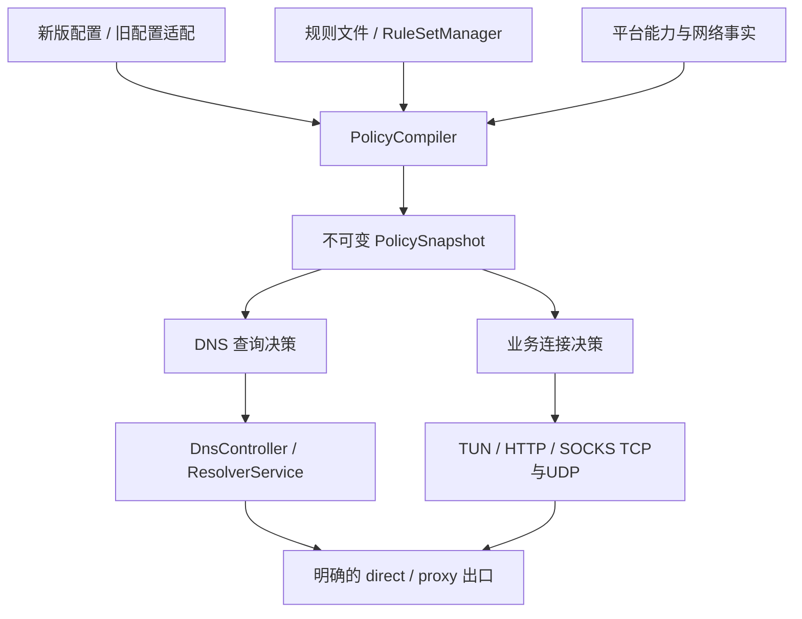

# DNS、域名/IP 分流与规则集重构详细方案

> Status: Released in v2.1.7; cross-platform runtime acceptance remains incomplete
> Type: Design
> Last verified: 2026-10-07
> **创建日期：**2026-10-05。
> **用途：**记录客户端 DNS、域名/IP 分流与规则集的统一重构方案。
> **适用对象：**内核与 CLI 开发者、维护者和评审者。
> **当前状态：**P0–P5 策略代码已从正式客户端/CLI 入口接入，P2P v2 production gate 已默认开启并接入桌面、Windows、Android、iOS 生产构建；跨平台 VPN runtime、真实 NAT 和设备验收仍不完整。v2.1.7 已发布的策略资产与后续版本候选需以对应发行页和 CI 为准。Linux 实机已有 HTTP、SOCKS UDP、DNS 四种上游、Fake-IP 与规则更新成功证据；HTTPS/proxy TCP 等仍有未通过项。迁移中的整份策略等价受已知语义差异限制，运行时显式 `p2p.enabled=false` 仍可回 relay。
> **P0 产物与验证：**[旧行为与平台能力基线](DNS_ROUTING_POLICY_BASELINE_CN.md)，包含静态样本、差分合同和验证边界。
> **P1 产物与验证：**[离线编译和诊断](DNS_ROUTING_POLICY_P1_CN.md)，记录已实现语法、接口、CLI、扩展与运行时边界。
>
> **P2 实施记录：**[执行路径接入](DNS_ROUTING_POLICY_P2_CN.md)，记录快照、连接与 DNS 出口接入及验证边界。
> **分析基线：**`99892a8cf1dda90f8da475fb044016e7ae33d195`。
> **上一层索引：**[Design Documents](README.md)。

## 1. 目标、范围与已确定的取舍

本期交付**统一的客户端策略内核和 CLI**，解决配置入口分散、DNS 与业务分流脱节、规则行为难解释的问题。

按照已确认的选择：

| 项目 | 决策 |
|---|---|
| 配置体验 | 简短规则文件为主；JSON 配置 DNS 上游、规则集来源和运行参数 |
| 旧配置 | 继续读取；迁移工具和新配置生成器统一输出新版格式 |
| 匹配原则 | 手写规则优先于规则集；具体域名、具体网段优先 |
| DNS 默认 | 跟随域名分流；失败只在同出口内尝试备用上游 |
| 域名信息 | 新建 TUN 配置默认 Fake-IP；HTTP/SOCKS 保留原始请求域名 |
| 协议范围 | 补齐 IPv4 TCP/UDP 和 DNS 出口；新版策略明确限制 IPv6 |
| 更新方式 | 自动更新规则集、运行中生效；失败继续使用上一完整版本 |
| 图形界面 | 桌面、Android、iOS、Guardian 的界面改造另排 |
| 移动端 | 本期包含共享内核所需的 native 接入与能力检查 |

成功标准：

- 常见分流只需维护一份规则文件，不再同步修改 bypass、DNS rules 和 Geo 生成文件。
- 同一目标在 TUN、HTTP、SOCKS TCP、SOCKS UDP 中使用同一套策略语义。
- 能离线解释“命中哪条规则、选择哪个 DNS、查询和连接分别走哪里”。
- 更新失败不改变当前策略；更新成功不改变已有连接的出口。
- 旧配置不会因新版默认值而自动开启 Fake-IP、改变 DNS 回退或修改 IPv6 行为。

本方案依据当前源码。主要结构问题可见于[配置模型](../../ppp/configurations/AppConfiguration.h#L72)、[DNS 持有通用策略的位置](../../ppp/app/client/dns/DnsInterceptor.cpp#L147)及[本地代理连接路径](../../ppp/app/client/proxys/VEthernetLocalProxyConnection.cpp#L198)。

---

## 2. 新配置与规则语义

### 2.1 配置入口

新版客户端策略统一放在 `client.policy`，版本号固定为 `2`。

JSON 负责资源定义；规则文件负责“哪些目标采取什么动作”。两者职责固定，不提供另一套等价的 JSON 路由规则数组。

示例使用已实现的 v2 格式；来源文件须实际存在，平台能力另由 `policy check` 检查：

```json
{
  "client": {
    "policy": {
      "version": 2,
      "rules": {
        "path": "./routing.rules"
      },
      "ipv6": "block",
      "dns": {
        "mode": "auto",
        "resolvers": {
          "local": {
            "via": "direct",
            "servers": ["doh.pub"]
          },
          "remote": {
            "via": "proxy",
            "servers": ["cloudflare"]
          }
        }
      },
      "rule-sets": {
        "cn-domains": {
          "format": "geosite-dat",
          "source": {
            "path": "./rules/geosite.dat"
          },
          "tag": "cn"
        },
        "cn-ips": {
          "format": "geoip-dat",
          "source": {
            "path": "./rules/geoip.dat"
          },
          "tag": "cn"
        }
      },
      "updates": {
        "enabled": true,
        "interval": "24h",
        "via": "proxy"
      }
    }
  }
}
```

明确约束：

- `rules.path` 必须是存在且可读的文件，不再将缺失文件解释为规则文本。
- 路径相对主配置所在目录解析，不依赖进程工作目录。
- 规则集 `source.path`、`source.url` 二选一。
- 本地源检查文件变化；远程源按更新周期下载。
- 远程源支持可选 `sha256` 固定版本校验；未配置时，内容哈希仅用于标识版本。
- 普通路由、peer 网关、网卡、节点信息继续由现有网络配置管理，不并入策略规则。
- DNS provider 名称只是仓库已有上游列表的简称，不再隐含查询出口。

新版与旧版客户端策略字段同时显式出现时，返回 `E_POLICY_SOURCE_CONFLICT`，列出冲突字段。服务端专用配置不因此冲突。

### 2.2 规则文件

保留现有分组风格，增加 `reject`、命名规则集引用和独立 DNS 例外：

```ini
default proxy

dns direct local
dns proxy remote

[direct]
lan
example.cn
=login.example.com
192.0.2.0/24
set:cn-domains
set:cn-ips

[proxy]
example.com
*.service.example
198.51.100.10

[reject]
ads.example

# 可选：只覆盖解析上游，不改变业务连接动作
[dns:local]
=internal.example
```

语法固定如下：

| 语法 | 含义 |
|---|---|
| `[direct]`、`[proxy]`、`[reject]` | 后续条目的业务动作 |
| `example.com` | 匹配根域名及其子域名 |
| `=example.com` | 只匹配完整域名 |
| `*.example.com` | 只匹配子域名 |
| `regexp:...` | 域名正则；加载时编译 |
| IPv4、IPv4 CIDR | 目标地址匹配 |
| `lan` | 展开为固定、版本化的内建 IPv4 本地网段集合 |
| `set:name` | 引用 JSON 中声明的规则集 |
| `[dns:name]` | 域名解析例外，指向命名 resolver |
| `default` | 未命中业务规则时的动作 |

补充规则：

- 新版不提供 `default auto`；`auto` 只存在于旧配置兼容模型。
- `[dns:name]` 接受域名条件和域名规则集，禁止 IP 条件，避免“必须先解析才能决定如何解析”的循环。
- 首期不增加规则文件递归 include；复用数据通过命名规则集完成。
- 注释、空行和现有域名缩写继续支持；导出时保留用户注释及原有分组。
- 域名规范化统一处理大小写、尾点和标签边界；国际化域名要求使用 Punycode，暂不新增 IDNA 转换依赖。

### 2.3 确定性的优先级

**先判断域名，再判断 IP，最后默认动作。**

当连接具有有效域名信息且域名规则命中时，该动作不再被后续 IP 规则覆盖。没有域名或域名未命中时才进入 IP 匹配。

域名阶段：

1. 手写条目优先于规则集条目。
2. 同来源层中：精确域名 → 最长域名后缀 → 关键词类型 → 正则。
3. 后缀长度相同时，仅子域名匹配优先于包含根域名的匹配。
4. 多个正则命中时，按声明顺序。
5. 规则集之间同等匹配时，按 `set:` 引用顺序。

IP 阶段：

1. 手写条目优先于规则集条目。
2. 同来源层中采用最长前缀匹配。
3. 同等规则集匹配按引用顺序。

冲突处理：

- 相同手写条件、相同动作：去重并提示。
- 相同手写条件、不同动作：报错，同时指出两处位置。
- 规则集之间冲突：使用上述顺序，并在诊断中显示被覆盖来源。
- 阴影规则能够确定时发出警告；不声称能够完整判定任意正则之间的重叠关系。

**旧规则继续使用原优先级。** 新版优先级通过版本区分，不能直接替换旧比较逻辑。

### 2.4 DNS 决策

每次查询按以下步骤执行：

1. 查询域名命中业务 `reject` 时返回 `REFUSED`。
2. 查询独立 DNS 例外。
3. 否则按域名业务动作选择 `dns direct` 或 `dns proxy`。
4. 域名未命中时，使用业务默认动作对应的 resolver。
5. 在选定 resolver 内按服务器顺序尝试，全部失败返回 `SERVFAIL`。

resolver 的 `via` 明确决定查询出口：

- `direct`：通过底层网络 socket。
- `proxy`：通过 PPP 隧道传输。
- 不允许失败后隐式调用系统解析器、跨 resolver 或跨出口回退。
- IP 规则在解析结果出来后决定业务出口，不触发反复更换 DNS、重新解析的循环。
- 显式 DNS 例外可以与业务出口不同，`explain` 必须显示这一差异。

新模板复用仓库现有 provider 目录生成 `local`、`remote`，默认只展开 DoH/DoT 条目并验证证书；用户可以显式配置 UDP/TCP。旧配置保留其原协议顺序。

### 2.5 默认值

| 项目 | 新版默认 |
|---|---|
| 默认业务动作 | `proxy` |
| DNS 模式 | `auto`：TUN 为 Fake-IP，本地代理直接使用请求域名 |
| Fake-IP 地址池 | `198.18.0.0/16`，启动时检查与实际网络冲突 |
| TCP 嗅探 | 关闭；真实 IP 模式可显式开启 |
| IPv6 | `block` |
| DNS 单次查询总时限 | 5 秒，备用尝试共享该时限 |
| DNS 正缓存 TTL 上限 | 300 秒，不延长上游 TTL |
| DNS 缓存容量 | 8192 项，额外设置 64 MiB 总量上限 |
| 远程更新 | 24 小时，加入 ±10% 抖动 |
| 更新出口 | `proxy` |
| 本地规则变化检查 | 每 2 秒检查，500 ms 合并连续变更 |

这些默认值只适用于新版配置，不覆盖旧配置的有效值。

---

## 3. 内核结构、执行路径与在线更新

### 3.1 模块划分

新增独立策略模块，由客户端运行时持有，移出 DNS 模块。



核心接口约定：

| 类型 / 接口 | 输入与输出 |
|---|---|
| `PolicySourceLoader` | 读取配置、规则和数据源，产生带来源信息的语法模型 |
| `PolicyCompiler::Compile` | 模型、数据版本、平台能力 → 快照或结构化诊断；不联网、不改路由 |
| `PolicyEvaluator::EvaluateDomain` | 域名 → 命中动作或未命中 |
| `PolicyEvaluator::EvaluateIp` | 目标 IPv4 → 命中动作或默认动作 |
| `PolicyEvaluator::PlanDns` | 查询上下文 → resolver、出口、应答模式、缓存命名空间 |
| `PolicyRuntime::Prepare/Commit` | 准备完整候选版本并原子发布 |
| `RuleSetManager` | 下载、版本缓存、更新调度和失败回退 |
| `DestinationResolver` | 保留域名证据，异步解析真实地址并生成连接决策 |

公共数据结构至少包含：

- `FlowContext`：入口、TCP/UDP、原始目标、端口、域名及域名来源。
- `RouteDecision`：动作、连接地址、命中规则、原因、策略版本。
- `DnsPlan`：resolver、实际出口、Fake-IP/真实应答、缓存标识。
- `PolicyDiagnostic`：错误码、级别、JSON 路径或文件行号、相关原始位置。
- `PlatformCapabilities`：直连 TCP/UDP、隧道 DNS、IPv6 阻断、平台流量接管能力。

连接完成决策后只保留所需结果和出口句柄，避免长期连接把整份旧规则索引一直留在内存中。正在解析或建立的连接可以短期持有快照。

### 3.2 域名与连接上下文

域名来源按以下顺序使用：

1. HTTP/SOCKS 请求明确携带的目标域名。
2. 已知 Fake-IP 映射。
3. 可选 HTTP Host/TLS SNI 嗅探。
4. 无域名信息，按 IP 匹配。

原始域名与解析后的 IP 分开保存，禁止在本地代理中解析后覆盖并丢弃原始域名。

具体接入：

- TUN TCP、TUN UDP：建立流时使用统一 `DestinationResolver`。
- HTTP CONNECT、普通 HTTP 代理：在选择直连、MUX 或隧道前完成策略决策。
- SOCKS TCP：保留 DOMAIN 类型目标。
- SOCKS UDP：保留每个数据报的 DOMAIN 信息，再建立相应 UDP 流。
- `direct` 失败返回明确错误；`proxy` 失败不尝试直连。
- `reject` 在 TCP 接受/连接阶段拒绝；UDP 丢弃并记录有界计数；DNS 返回明确拒绝应答。

真实 IP 模式不从共享 IP 缓存反推唯一域名。应用自带加密 DNS、无法识别的 TCP 协议和不可嗅探的 UDP，按实际可见信息匹配。

### 3.3 补齐实际出口能力

**跨平台 IPv4 UDP 直连是本期必做项。**

抽出共享 UDP 出口实现，复用现有异步 socket、数据报端口管理及平台 socket 保护机制。覆盖：

- TUN 和 SOCKS UDP 的直连与隧道发送。
- 回复目标校验、空闲超时、关闭取消、队列上限。
- Fake-IP 与真实端点的双向转换。
- 流键包含原始目标和必要的域名身份，避免不同域名共用 IP 时串用决策。
- 直接出口不依赖隧道载荷对象来分配缓冲区或维持 socket。

DNS 传输增加独立出口接口：

- UDP 使用受保护的底层 socket 或现有隧道数据报通道。
- TCP 提供异步读写流的 direct/proxy 实现，隧道端复用现有连接协议和字节流传输能力。
- DoT/DoH 的 TLS 与 HTTP 编解码运行在该流之上，保持原 hostname 的 SNI 和证书校验。
- 不通过查询目的 IP 的系统路由“猜测”DNS 实际出口。
- 不新增隧道协议格式或服务端配置要求。

上游 hostname 优先使用结构化条目的 endpoint 地址与 bootstrap 地址。必须联网 bootstrap 时，只使用明确配置的直接 bootstrap resolver，并检查依赖环。节点控制连接的 bootstrap 独立于代理 DNS，防止隧道启动依赖自身。

### 3.4 DNS 生命周期与缓存

保留 `DnsController` 的会话失效、取消及关闭顺序。将解析器可用性与“是否接管系统 DNS”分开：

- proxy-only 也需要策略解析服务。
- 系统 DNS 接管只属于 TUN 平台层。
- 查询及回调同时携带 session generation 和 policy generation。
- 关闭 session 后的回调不得发送、写入新版本缓存或恢复失效连接。

新版客户端采用独立 DNS 缓存：

- 键包含域名、QTYPE/QCLASS、resolver 配置指纹、查询出口、ECS 和影响应答的 DNS 标志。
- 策略更新后只有语义完全相同的缓存命名空间可继续命中。
- 正缓存尊重应答 TTL；负缓存使用有效 SOA 信息并设上限。
- 同键并发请求合并，取消单个等待者不会误取消其他等待者。
- 新版客户端不读写仅按域名共享的旧全局业务缓存。
- 服务端缓存和旧配置所需行为保持各自边界。

客户端 DNS 拦截范围仍明确为现有 UDP/53；TCP DNS、DoH、DoT 应用流量不被宣称为通用 DNS 拦截。

### 3.5 Fake-IP 生命周期

Fake-IP 映射只负责**地址与域名身份**，不永久保存业务动作。

- 规则更新保留映射；新连接用当前策略重新决策。
- 已有连接保留已确定的真实端点和出口。
- 首次真实解析未完成时，TCP 等待解析；UDP 使用每流最多 32 包、64 KiB 的有界队列，总等待不超过 DNS 查询时限。
- 超时或失败丢弃等待队列并记录原因，禁止把 Fake-IP 当真实目标发往网络。
- DNS TTL 与 Fake-IP 地址身份的寿命分开。

为避免重启后旧缓存地址被映射到其他域名，映射按配置身份持久化：

- 使用版本化映射文件与追加日志，新增映射持久化成功后才发出对应 Fake-IP 应答。
- 写入可短暂批处理，合并窗口不超过 10 ms。
- 同一地址池内不把已分配地址重新分配给另一个域名。
- 池耗尽返回 `SERVFAIL`，由诊断明确提示；首期不实现可能错误复用地址的 LRU 回收。
- 映射损坏不得静默重建并重用旧地址。
- 更换地址池、清空映射属于需要重启并处理客户端 DNS 缓存的操作，不在线执行。

### 3.6 系统路由与 IPv6 边界

新版业务域名/IP 规则主要由内核处理，不将每条 direct CIDR 自动投影成系统绕行路由。

系统路由负责：

- 接管配置范围内的流量。
- 保持节点、底层网关和直接出口可达。
- Fake-IP 地址池可达。
- 保留显式普通路由与 peer 拓扑能力。

这样可以避免系统先绕过 TUN，导致内核里的域名例外失去执行机会。平台无法接管的本地或显式路由例外，需要在能力报告中列明，不能宣称这些流量也受完整策略控制。

新版 `ipv6:block`：

- DNS AAAA 返回空成功应答。
- 本地代理拒绝 IPv6 字面量目标。
- TUN 对受管理的外部 IPv6 流量执行接管后阻断或平台过滤。
- 不修改全机 IPv6 开关；所需平台变更纳入正常连接事务并可回滚。
- 平台不能保证阻断时，拒绝启动该新版 TUN 策略，说明缺失能力。
- IPv6 CIDR 规则报“不支持”；Geo 数据内的 IPv6 条目计数并跳过。
- 旧配置的 IPv6 行为不受新版默认值影响。

### 3.7 自动更新与原子发布

在线更新范围为**规则文件及其已声明规则集**。DNS 上游配置、Fake-IP 地址池、监听地址、运行模式和网络拓扑变更需要重新启动或重连。

更新流程固定为：

1. 在后台获取本轮变更的所有数据源。
2. 检查下载结果、大小、哈希、格式及所需 tag。
3. 使用未变更来源的当前版本，构建完整候选数据包。
4. 重新解析规则并编译全部索引。
5. 完成引用、冲突、能力和资源检查。
6. 写入候选 manifest。
7. 原子发布一份包含索引、DNS 计划及版本信息的运行时对象。
8. 记录成功版本，保留当前和上一完整持久化版本。

具体行为：

- 同轮任一必要来源失败，整轮不提交。
- 下载或编译线程不持有流量处理锁。
- 更新任务串行化；运行时查询通过不可变快照读取。
- 旧连接继续使用原决策；新 TCP 连接和新 UDP 流使用新策略。
- 已存在 UDP 流直到空闲超时才重新选择出口，不逐包切换。
- 文件只写了一半、标签消失、正则错误、磁盘满等情况均保留旧版。
- 网络更新默认 30 秒超时、单源 64 MiB 上限；失败指数退避，从 1 分钟增加至最多 1 小时。
- 支持条件请求；响应未变化时不重复编译。
- 默认验证 HTTPS 证书，禁止重定向到较弱协议；URL 查询参数和凭据不写入日志。

首次启动没有可用缓存时，先建立所需控制通道、获取必要数据并完成策略编译，之后才开放业务流量。不能用空规则临时启动。

---

## 4. CLI、兼容迁移与实施顺序

### 4.1 CLI 接口

新增 `ppp policy ...` 子命令，在普通应用初始化之前分派，避免离线命令启动线程、监听器、虚拟网卡或系统网络配置。

| 命令 | 行为 |
|---|---|
| `policy init` | 生成规则文件和 `client.policy` 配置片段 |
| `policy check` | 离线校验配置、规则、已有规则集和指定平台能力 |
| `policy explain` | 离线解释域名/IP 的匹配、DNS 与业务出口 |
| `policy migrate` | 分析旧配置并输出新版文件及迁移报告 |
| `policy export` | 导出有效策略，展开默认值和数据版本 |
| `policy update` | 显式获取规则集、校验并准备新的完整数据包 |
| `policy status` | 读取现有运行时状态文件，显示活跃版本及更新状态 |

示例：

```bash
ppp policy check \
  --config client.json --runtime tun --platform linux

ppp policy explain \
  --config client.json \
  --domain api.example.com --ip 203.0.113.10 \
  --network tcp --port 443 --runtime tun

ppp policy migrate \
  --config old-client.json --out ./migrated

ppp policy update --config client.json
```

CLI 约定：

- `check`、`explain`、`export` 默认完全离线。
- `explain` 没有提供 IP 时，明确显示 IP 阶段需要解析，不能伪造最终结果。
- 人类可读输出和 `--json` 输出使用同一诊断模型。
- 退出码：`0` 成功，`2` 配置/规则错误，`3` 来源不可用，`4` 能力不支持，`5` 迁移存在未处理的语义差异。
- 诊断包含命中规则、来源、策略版本、DNS 出口和业务出口。
- `export` 默认只导出策略，不输出节点凭据或完整连接配置。
- `status` 检查进程身份和状态时间，过期文件显示为离线。
- 不为这些命令新增管理 HTTP 服务。

`init` 提供 `proxy-all`、`direct-all`、`split-cn` 三种模板。`split-cn` 要求明确提供 GeoIP/GeoSite 本地路径或来源，不内置未经确认的下载站点。

### 4.2 兼容策略

旧入口统一经过 `LegacyPolicyAdapter`，汇总：

- `client.routing` 及其短别名。
- 顶层 `routing.rules`。
- `--bypass`、`--dns-rules`。
- `geo-rules`。
- 旧 DNS 与客户端缓存字段。

适配器产生同一策略中间模型，但保留旧语义标记，包括：

- 原有来源优先级和规则加载顺序。
- `default auto` 的 native 路由回退。
- 旧 DNS provider、NIC/TUN 与 ECS 解释。
- 旧 Fake-IP、AAAA 和 DNS fallback 行为。
- 旧平台路由投影要求。

运行时不再到处判断旧字段；兼容差异集中在适配和编译层。

迁移分为两种结果：

- **可等价转换**：输出新版 JSON、规则文件及数据引用；在转换报告中给出行为对照。
- **存在语义差异**：输出诊断和待调整草案，不生成“已完成无损迁移”的配置。

重点报告：

- 旧 `auto`、特殊网关、跨出口 DNS 回退。
- 旧正则优先级及潜在顺序变化。
- 新版 Fake-IP/IPv6 默认值。
- 缺失文件曾被当作 inline 的情况。
- 依赖生成文件副作用的外部使用。

旧配置仍可运行；新写入工具只输出新版格式。迁移必须显式执行，不在连接时改写用户文件。

### 4.3 实施分批

| 阶段 | 主要交付 | 合入门槛 |
|---|---|---|
| P0：固定现状 | 旧优先级与平台能力表；行为样本；离线差分测试框架 | 能重现旧入口的有效行为 |
| P1：策略编译与诊断 | 新语法、来源模型、快照、匹配索引、`check/explain` | 无网络依赖的语义测试通过 |
| P2：执行路径统一 | HTTP/SOCKS/TUN 接入；跨平台 IPv4 UDP direct；明确 DNS 出口 | 同目标跨入口获得一致决策 |
| P3：DNS 与 Fake-IP | 独立缓存、解析合并、映射持久化、等待队列、关闭取消 | 缓存隔离及生命周期测试通过 |
| P4：在线更新 | 数据版本、调度、完整候选编译、原子发布、失败保留旧版 | 故障注入与并发更新测试通过 |
| P5：迁移与发布 | 旧适配器、`init/migrate/export/status`、文档和完整构建 | 兼容样本与平台能力验收通过 |

P0 已完成（2026-10-05）：50 个手工预期案例直接调用现有配置/规则解析器和纯决策函数，
离线比较框架支持实际报告导出和独立候选报告比较。隔离构建与 7 个相关 CTest 目标通过。
平台接入能力仅按源码固定，未验证真实 VPN 会话或 DNS 实际出口；完整验证记录见
[P0 基线](DNS_ROUTING_POLICY_BASELINE_CN.md)。新版策略仍由显式 `client.policy.version=2` 选择，P2P v2 则由生产构建 gate 和运行时配置独立控制。

P1 已完成（2026-10-05）：新增独立 v2 加载器、不可变快照与匹配索引，提供启动前分派的
离线 `check/explain`。来源 SHA 校验和内存物化防止编译读取未校验版本。
19 个相关 CTest 目标通过，包含旧基线、配置加载保护和新策略语义/性质/入口测试。
P1 阶段普通运行路径拒绝显式 `client.policy`，该保护在 P2 完成执行路径接入后解除。
具体扩展及限制见 [P1 实现记录](DNS_ROUTING_POLICY_P1_CN.md)；未启动或验证新版 VPN 会话。

P2 已完成执行路径接入与离线验收（2026-10-05）：客户端独立持有原子策略快照，
HTTP/SOCKS/TUN 接入统一决策与显式 DNS 出口，共享 IPv4 UDP 出口保留流身份和有界队列。
隔离 Linux 内核编译链接成功，34 个聚焦 CTest 目标及相关 ASan/UBSan 验证通过。
P2 的 `auto` DNS 暂时使用真实地址，持久化 Fake-IP 与独立缓存仍在 P3。
平台条件能力、内部 UDP 保留地址和验证范围见 [P2 记录](DNS_ROUTING_POLICY_P2_CN.md)。

P3/P4/P5 的详细接口、实施约束和离线验收门槛已补充（2026-10-07）：
[P3 DNS/Fake-IP](DNS_ROUTING_POLICY_P3_CN.md)、
[P4 完整数据包更新](DNS_ROUTING_POLICY_P4_CN.md)、
[P5 兼容迁移与 CLI](DNS_ROUTING_POLICY_P5_CN.md)。按用户要求先补充各阶段详细方案与
约束，再由 Luna 并行实现，主代理审查共享入口并执行联合验收。

P3–P5 已完成实现与离线验收（2026-10-07）：持久化 Fake-IP、语义隔离缓存与解析合并、
完整更新包与失败回滚、运行时更新和业务 gate、旧配置适配、七个策略 CLI 命令及使用文档
均已落盘。最终 standalone CTest 169/169 通过，Linux 258 个生产 C++ 源文件完成编译
链接，聚焦 ASan/UBSan 与持久化 store 的 TSan 通过。完整验证边界、离线性能记录及
已知迁移差异见 [P5 完成记录](DNS_ROUTING_POLICY_P5_CN.md#5-完成记录)。

每批可独立评审。P1–P4 期间新版只由显式 `client.policy.version=2` 启用；最终完成后，新模板默认生成 v2，旧文件继续走兼容入口。

规则匹配优化与模型重构一起完成：

- 精确域名使用哈希索引。
- 后缀使用反向标签树。
- IPv4 使用前缀树。
- GeoSite 关键词使用共享关键词索引。
- 正则加载时编译，查询时不重新构造。
- 所有索引返回相同优先级元组，不能因换数据结构改变语义。

---

## 5. 验证、验收与限制

### 5.1 必须覆盖的行为测试

| 范围 | 关键场景 |
|---|---|
| 配置 | 缺失路径、重复 ID、未知字段、非法引用、相对路径、混用新旧入口 |
| 规则 | 精确/后缀/子域名、CIDR 重叠、手写覆盖规则集、正则顺序、冲突位置 |
| DNS | 域名分流、独立 DNS 例外、同出口备用、跨出口禁止回退、bootstrap 环 |
| 缓存 | 同域名不同 resolver、ECS、QTYPE、策略版本；TTL 到期与负缓存 |
| 域名上下文 | HTTP/SOCKS 原始域名保留；共享 CDN IP；缺少域名时按 IP |
| UDP | 各平台直连、隧道、回复校验、SOCKS DOMAIN、Fake-IP 反向改写 |
| Fake-IP | 解析前首包、超时、池满、并发分配、重启恢复、日志损坏、旧地址稳定 |
| IPv6 | AAAA 行为、代理 IPv6 目标拒绝、TUN 阻断能力、失败回滚 |
| 更新 | 下载失败、坏数据、tag 消失、半写文件、磁盘满、并发查询、关闭中提交 |
| 连接稳定性 | 更新前后的 TCP/UDP 分别绑定正确版本，旧连接不切换出口 |
| 兼容 | 新旧配置样本差分、`auto`、旧 Geo、CLI 来源和平台投影 |

DNS 与出口验证使用本地模拟上游和可注入传输接口；不能以启动日志代替实际请求和回复的断言。

### 5.2 平台与构建验证

实现阶段执行：

- C++ include 边界、Visual Studio 源文件清单检查。
- 相关独立 C++ 测试，再执行完整独立测试集。
- ASan/UBSan 与 TSan 分开运行。
- Windows 使用配置好的 x64 Visual Studio 工具链构建。
- Linux、Windows、macOS 对新策略执行能力测试。
- Android、iOS 验证 native 编译和平台适配契约；设备测试单独记录。

有权限要求的网络 E2E 在单独授权的隔离环境执行。测试覆盖直连与隧道 TCP/UDP、DNS 实际出口、IPv6 阻断及退出后的路由/DNS 恢复。

### 5.3 性能验收

固定随机种子构造小型、十万级和百万级规则数据，记录：

- 加载与编译耗时、峰值内存。
- 域名/IP 命中与未命中的 p50/p95/p99。
- 正则占比增加时的退化情况。
- 在线更新期间的查询延迟。
- 缓存命中与未命中开销。

新版热路径不得读取规则文件、下载数据或编译正则。

另外比较新版内核直连与旧系统 bypass 的实际 TCP/UDP 吞吐、CPU 和延迟。两者执行路径不同，不能仅凭匹配微基准宣布性能更好；实际开销作为发布验收结果明确记录。

### 5.4 发布可观察性

沿用现有运行时快照与遥测接口，增加：

- 活跃策略版本、规则数量及各数据源版本。
- 最近更新成功时间、失败阶段及错误码。
- 按动作汇总的命中量。
- DNS 缓存命中、超时、上游失败。
- Fake-IP 使用量、解析等待、耗尽及持久化错误。
- 当前平台缺失能力和需要重启的变更。

普通日志只记录规则 ID、版本和错误摘要；完整域名追踪由显式调试开启。节点配置、订阅凭据和带认证信息的 URL 不进入诊断输出。

方案形成时仅完成源码分析，后续 P0–P5 已完成上文所列实现和 Linux 隔离离线验证。
GitNexus 索引未更新，使用源码、调用点、差异及聚焦测试评估影响，未声称执行其当前索引
分析。2026-10-07 离线批次当时未构建 Windows/macOS/Android/iOS；之后 Android 四 ABI
候选实链及 ZIP、Debian 10 GNU `stdc++fs` CI、Windows x64/ARM64 构建已有成功记录。
这些构建不等于 VPN runtime 验收；macOS/iOS 仍未验证。真实 VPN 出口、系统路由/DNS 恢复、
外网更新及实际 direct/bypass 吞吐在上述测试中未完整验证。离线批次未启动 PPP、改变路由/DNS
或安装驱动。

当前验证状态：TSan 锁序与 FakeClock lost wakeup 已修复；普通 target 通过，无 suppression 的
TSan 连续 50 次通过，修复前第 9 次复现。最终同 SHA 全套 CI 待验证，不能据此声明 CI 全绿、
版本已发布或全部 runtime 已验收。

2026-10-07 后续按用户授权完成 Linux 实机测试及主动恢复，详见
[实机验证记录](../testing/DNS_ROUTING_POLICY_LINUX_LIVE_CN.md)。原配置与系统 DNS
保持一致，原服务恢复 connected 并有 HTTP 回复；HTTPS 等限制与未验收项按记录保留。
